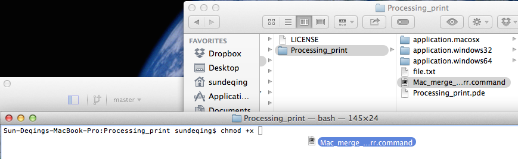

# Catch-output-of-exported-Processing-sketch

##Mac OS

Prior to Mountain Lion, stdout and stderr (where println goes to) is forwarded to system log, which can be seen in Console app. So we need to manually forward those standard streams to log file so we can debug sketchs.

###Folder structure of Mac OS Processing application

The exported application has a executable file in "Contents/MacOS/". The application can be opened by executing that file. 

When that file is executed in terminal. You should see all it's print and error in terminal.

There is a "Mac_merge_stdout_stderr.command" file redirect stdout and stderr to a text file. For more info refer to http://en.wikipedia.org/wiki/Redirection_(computing)

###Add execution permission

If you see something like this when you double click .command file: (The file “Mac_merge_stdout_stderr.command” could not be executed because you do not have appropriate access privileges)

You need to add "x" permission to the .command file.

Open terminal window and type "chmod +x " and drag the .command file in,

You should see like "chmod +x /Volumes/Mac_storage/github/Catch-output-of-exported-Processing-sketch/Processing_print/Mac_merge_stdout_stderr.command 
" in you terminal.

Press return to finish this step.

###Get output

Double click the .command file and you should see a text file with output.

